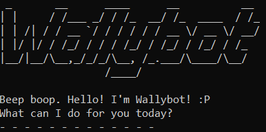

# User Guide to ***Wallybot***

Wallybot is a **personal assistant chatbot, optimised for use via a
Command Line Interface** (CLI).
It keeps track of your tasks and allows you to manage them!

- [Quick start](#quick-start)
- [Features](#features)
    - [Adding a Todo: `todo`](#adding-a-todo-todo)
    - [Adding a Deadline: `deadline`](#adding-a-deadline-deadline)
    - [Adding an Event: `event`](#adding-an-event-event)
    - [List all tasks: `list`](#list-all-tasks-list)
    - [Mark a task: `mark`](#mark-a-task-mark)
    - [Unmark a task: `unmark`](#unmark-a-task-unmark)
    - [Find tasks by keyword: `find`](#find-tasks-by-keyword-find)
    - [Delete a task: `delete`](#delete-a-task-delete)
    - [Exiting the program: `bye`](#exiting-the-program-bye)
    - [Saving the data](#saving-the-data)
    - [Editing the data file](#editing-the-data-file)
- [Command summary](#command-summary)

## Quick start
1. Ensure Java `11` is installed on your computer.
2. Download `wallybot.jar` from [here](https://github.com/wallywallywally/ip/releases).
3. Open a command terminal, `cd` into the folder where the JAR file is
and use `java -jar wallybot.jar` to run Wallybot!

&nbsp;
## Features

### Adding a Todo: `todo`
Adds a task of Todo type.

Format: `todo DESCRIPTION`

Example: `todo complete tutorial`

&nbsp;
### Adding a Deadline: `deadline`
Adds a task of Deadline type.

Format: `deadline DESCRIPTION /by BY`

- `BY` must be provided.

Example: `deadline complete assignment /by Friday`

&nbsp;
### Adding an Event: `event`
Adds a task of Event type.

Format: `event DESCRIPTION /from FROM /to TO`

- Both `FROM` and `TO` must be provided.

Example: `event band practice /from 2pm /to 3pm`

&nbsp;
### List all tasks: `list`
Shows a lists of all tasks stored.

Format: `list`

&nbsp;
### Mark a task: `mark`
Mark a task as completed.

Format: `mark INDEX`

- Marks the task at the specified `INDEX`. The index refers to
the number shown in `list`.

Example: `mark 5`

&nbsp;
### Unmark a task: `unmark`
Unmark a task.

Format: `unmark INDEX`

- Unmarks the task at the specified `INDEX`. The index refers to
the number shown in `list`.

Example: `unmark 2`

&nbsp;
### Find tasks by keyword: `find`
Find tasks that contain a given keyword.

Format: `find KEYWORD`

- If a phrase is passed, the entire phrase is searched.

Example: `find homework`

&nbsp;
### Delete a task: `delete`
Deletes the specified task.

Format: `delete INDEX`

- Deletes the task at the specified `INDEX`. The index refers to
the number shown in `list`.

Example: `delete 1`

&nbsp;
### Exiting the program: `bye`
Exits the program.

Format: `bye`

&nbsp;
### Saving the data
Wallybot's data is saved in the hard disk automatically after
any command that changes the data, removing the need to save manually.

&nbsp;
### Editing the data file
Wallybot's data is saved automatically as a txt file 
`[user]/Documents/wallybot_data.txt`.

> #### CAUTION
> Any changes that invalidate the data format will lead to
> incomplete data being read. Edits may also cause Wallybot to
> behave unexpectedly.
>  
> It is recommended to make a backup
> before editing.

&nbsp;
## Command summary

| Command  | Format and example                                                                     |
|----------|----------------------------------------------------------------------------------------|
| todo     | `todo DESCRIPTION` e.g. `todo complete tutorial`                                   |
| deadline | `deadline DESCRIPTION /by BY` e.g. `deadline complete assignment /by Friday`       | 
| event    | `event DESCRIPTION /from FROM /to TO` e.g. `event band practice /from 2pm /to 3pm` |
| list     | `list`                                                                                 |
| mark     | `mark INDEX`  e.g. `mark 2`                                                        |
| unmark   | `unmark INDEX`                                                                         |
| find     | `find KEYWORD` e.g. `find homework`                                                |
| delete   | `delete INDEX`                                                                         |
| bye      | `bye`                                                                                  |